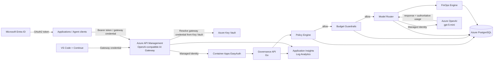

# Azure AI Governance Gateway

**Enterprise AI governance, routing and FinOps control plane on Microsoft Azure**

Azure AI Governance Gateway is a reference implementation showing how enterprise applications, IDE assistants and agent clients can access Generative AI through a centralized governance layer instead of connecting directly to model providers.

The gateway combines identity, policy enforcement, budget guardrails, model routing, provider-authoritative usage accounting, FinOps cost estimation and immutable audit evidence.

> **Status:** Active development
> **Current milestone:** Stage 7 — real client integration
> **Verified clients:** OpenAI-compatible API clients and VS Code + Continue Chat
> **Current provider:** Azure OpenAI `gpt-5-mini`
> **Demo region:** Sweden Central

---

## What this project demonstrates

The project focuses on a simple enterprise question:

> How can developers and applications use AI normally while security, governance, routing and cost controls remain centralized and independently auditable?

The current implementation demonstrates:

- centralized AI access through Azure API Management;
- Microsoft Entra ID authentication for enterprise callers;
- API-key-style gateway credentials for IDE/API demo clients;
- APIM Managed Identity authentication to the backend;
- Container Apps EasyAuth as a separate backend identity boundary;
- policy decisions before provider invocation;
- `allow`, `review` and `deny` governance outcomes;
- monthly cost-center budget guardrails;
- logical model aliases independent from provider deployment names;
- Azure OpenAI access through Managed Identity rather than model API keys;
- provider-authoritative token accounting;
- cached-input token accounting when reported by the provider;
- FinOps pricing and cost calculation outside the provider adapter;
- pricing provenance persisted with usage records;
- OpenAI-compatible `/v1/models` and `/v1/chat/completions` endpoints;
- VS Code + Continue integration using the governed endpoint;
- audit metadata without persistence of raw prompts.

---

## Architecture



The Governance API does **not** replace Azure API Management. APIM remains the external gateway and authentication boundary; the Go service owns the business-governance workflow.

---

## Governed request flow

For an allowed request:

```text
Client
  -> Azure API Management
  -> trusted application/user identity
  -> Governance API
  -> governance policy
  -> monthly cost-center budget check
  -> logical model route
  -> Azure OpenAI
  -> provider-authoritative usage
  -> FinOps cost calculation
  -> PostgreSQL audit
  -> client response
```

Two fail-fast paths are important:

```text
governance review / deny
  -> no budget execution
  -> no model route
  -> no provider call
```

```text
budget review / deny
  -> no model route
  -> no provider call
```

This makes governance decisions meaningful operational controls rather than post-processing audit labels.

---

## Client interfaces

### Native governed AI API

The original provider-neutral interface remains available:

```text
POST /v1/ai/invoke
```

It accepts a logical requested model and governance context, then executes the existing governance pipeline.

### OpenAI-compatible facade

Stage 7 adds a client-friendly facade:

```text
GET  /openai/v1/models
POST /openai/v1/chat/completions
```

Current external logical model:

```text
aigov-fast-general
```

Internal logical route:

```text
fast-general
```

Current Azure route:

```text
azure-openai / gpt-5-mini
```

The facade is an adapter only. It reuses the same governance, budget, routing, provider, FinOps and audit path rather than creating a parallel control flow.

### VS Code + Continue

The repository has been verified with **VS Code + Continue** using the OpenAI-compatible endpoint.

Example Continue model configuration:

```yaml
name: Azure AI Governance Gateway
version: 0.0.1
schema: v1

models:
  - name: AIGOV Fast General
    provider: openai
    model: aigov-fast-general
    apiBase: https://<your-apim-name>.azure-api.net/openai/v1
    apiKey: ${{ secrets.AIGOV_CONTINUE_KEY }}
    useResponsesApi: false

    roles:
      - chat

    defaultCompletionOptions:
      stream: false
      maxTokens: 256
      temperature: 0
```

Store the gateway credential in `~/.continue/.env`; do not commit it to the repository.

Current Stage 7 compatibility intentionally supports non-streaming Chat Completions. Native tool/function calling and full streaming compatibility are planned follow-up work.

---

## Identity and authentication

The demo supports two client authentication modes at APIM.

### Enterprise user flow

```text
Client
 -> Microsoft Entra ID delegated token
 -> APIM validates tenant, audience, client and scope
 -> APIM derives trusted caller identity from oid/sub
 -> backend
```

The backend does not trust a user-controlled `caller_subject` field.

### IDE/API demo credential flow

```text
IDE / API client
 -> OpenAI-style Authorization: Bearer <gateway credential>
 -> APIM validates against a Key Vault-backed Named Value
 -> APIM maps the credential to trusted governance context
 -> backend
```

The gateway credential is **not an Azure OpenAI key**. Azure OpenAI local key authentication is disabled; the Governance API invokes Azure OpenAI with Managed Identity.

The current Stage 7 demo credential retains its historical `cursor-demo-api-key` resource name because it was introduced during Cursor compatibility work. VS Code + Continue can use the same OpenAI-compatible facade. Dedicated per-client demo identities are planned as a cleanup step.

---

## Governance policy

Current baseline classifications:

```text
public
internal
confidential
restricted
```

Baseline decision model:

| Classification | Decision |
|---|---|
| `public` | allow |
| `internal` | allow |
| `confidential` | review |
| `restricted` | deny |

Raw prompts are not persisted. The audit model stores a cryptographic hash, prompt character count and governance metadata instead.

---

## Budget guardrails

The runtime budget layer evaluates accrued monthly spend for the trusted cost center **before model routing and provider invocation**.

Current outcomes:

```text
allow  -> continue to model routing
review -> stop before provider invocation
 deny  -> stop before provider invocation
```

The demo persists:

- evaluated cost center;
- budget policy version;
- monthly limit;
- review threshold;
- accrued spend observed at decision time;
- resulting budget decision.

### Important MVP limitation

The current budget implementation evaluates accrued cost but does not reserve the expected cost of an in-flight request. It is therefore a governance guardrail, not an atomic financial hard cap under concurrency.

A production hard cap would require a reservation/ledger or another concurrency-safe pre-authorization mechanism.

---

## FinOps model

Provider execution and pricing are deliberately separated:

```text
provider -> reports authoritative usage
finops   -> owns mutable pricing and cost calculation
budget   -> consumes persisted financial evidence
router   -> orchestrates execution
```

Current Azure OpenAI pricing evidence was discovered through the Azure Retail Prices API and is persisted with its source and effective date.

Unknown pricing remains:

```text
NULL
```

It is never converted silently to a fabricated zero cost.

---

## Audit model

The operational PostgreSQL model includes:

```text
governance_requests
policy_decisions
budget_policies
budget_decisions
model_routes
usage_records
schema_migrations
```

An allowed request can therefore be traced from:

```text
caller / application
 -> governance decision
 -> budget decision
 -> logical route
 -> provider/model
 -> token usage
 -> pricing snapshot
 -> estimated cost
```

while raw prompt content remains outside the audit database.

---

## Azure components

| Capability | Azure / technology choice |
|---|---|
| External gateway | Azure API Management Consumption |
| Runtime | Azure Container Apps Consumption |
| Backend auth | Container Apps EasyAuth |
| Workload identity | Managed Identity + Azure RBAC |
| Secrets | Azure Key Vault |
| Operational audit | Azure Database for PostgreSQL Flexible Server 16 |
| Model provider | Azure OpenAI |
| Container registry | Azure Container Registry Basic |
| Observability | Application Insights + Log Analytics |
| Infrastructure as Code | Terraform |
| Application | Go |

The demo deliberately uses cost-conscious managed services. These choices are not automatically production recommendations.

---

## Demo vs production

The current environment is intentionally optimized for a low-cost reference deployment.

Demo choices include:

- APIM Consumption;
- Container Apps Consumption;
- PostgreSQL Burstable sizing;
- public service endpoints with explicit access controls where necessary;
- explicit PostgreSQL firewall allowlists;
- temporary exact-IP database access for migration/audit demonstrations;
- single-region deployment;
- no HA database configuration.

A production implementation should additionally evaluate:

- private endpoints / VNet integration;
- stable controlled egress;
- HA and disaster recovery;
- WAF/API protection;
- SIEM integration;
- enterprise policy administration;
- data-residency requirements;
- provider safety controls;
- CI/CD security gates;
- secret rotation and break-glass procedures;
- atomic budget reservations if strict hard caps are required.

---

## Repository structure

```text
.
├── .github/workflows/
│   └── ci.yml
├── docs/
│   ├── DEMO.md
│   ├── DEVELOPMENT_HISTORY.md
│   └── ROADMAP.md
├── infra/
│   ├── bootstrap/
│   └── envs/
│       ├── demo/
│       ├── demo-identity/
│       └── demo-network-access/
├── scripts/
│   ├── demo-db-access-open.sh
│   ├── demo-db-access-close.sh
│   └── register-azure-providers.sh
├── services/
│   └── governance-api/
│       ├── cmd/
│       ├── internal/
│       ├── migrations/
│       ├── scripts/
│       ├── Dockerfile
│       ├── compose.dev.yml
│       ├── go.mod
│       └── go.sum
├── .gitignore
├── SECURITY.md
└── README.md
```

---

## Local development

Requirements:

```text
Go
Docker / Docker Desktop
Terraform
Azure CLI
Git
jq
```

Run the Go test suite:

```bash
cd services/governance-api
go test ./...
go vet ./...
```

Validate shell scripts:

```bash
bash -n scripts/*.sh
bash -n services/governance-api/scripts/*.sh
```

Check Terraform formatting:

```bash
terraform fmt -check -recursive infra
```

The local Compose environment can use a deterministic mock provider so governance, routing, persistence and FinOps behavior can be tested without paid model calls.

---

## Public demo

A short VS Code + API + audit scenario is documented in:

[docs/DEMO.md](docs/DEMO.md)

The demo shows:

1. a real request from VS Code + Continue;
2. the same OpenAI-compatible endpoint from an API/agent-facing client;
3. governance and budget decisions in PostgreSQL;
4. routed Azure OpenAI model and provider-authoritative usage;
5. FinOps cost and pricing source;
6. confirmation that the raw prompt marker is not persisted;
7. cleanup of temporary exact-IP PostgreSQL access.

---

## Delivery status

| Stage | Capability | Status |
|---|---|:---:|
| 1 | Azure / Terraform foundation | ✅ |
| 2 | Managed platform foundation | ✅ |
| 3 | PostgreSQL + Governance API + workflow | ✅ |
| 4 | Microsoft Entra ID + APIM + backend identity boundary | ✅ |
| 5 | Governed provider abstraction + real Azure OpenAI | ✅ |
| 6A | Provider-neutral FinOps cost accounting | ✅ |
| 6B | Runtime cost-center budget guardrails | ✅ |
| 6C | Cost-aware multi-model routing | Planned |
| 7A | OpenAI-compatible facade | ✅ |
| 7B | IDE/API gateway credential + dual auth | ✅ |
| 7C | Cursor integration | Client plan limitation; not required for demo |
| 7D | VS Code + Continue Chat integration | ✅ |
| 7E | Dedicated agent identities + tools/function calling | Planned |

Stage 7 was intentionally pulled forward ahead of Stage 6C to prove that real developer clients can consume the governed platform without changing the underlying governance pipeline.

See [docs/ROADMAP.md](docs/ROADMAP.md) for the implementation roadmap and [docs/DEVELOPMENT_HISTORY.md](docs/DEVELOPMENT_HISTORY.md) for design/deployment history.

---

## Security notes

- No Azure OpenAI API keys are required by the application.
- Gateway demo credentials are stored in Azure Key Vault and referenced by APIM.
- Database passwords are retrieved from Key Vault and are not committed.
- Terraform state and plan files must never be committed; they can contain sensitive values.
- Compiled binaries and local IDE configuration are not source artifacts and are ignored.
- The demo does not intentionally persist raw prompts.
- Temporary direct PostgreSQL access is restricted to the exact current public IPv4 address and must be removed after use.

See [SECURITY.md](SECURITY.md).

---

## Disclaimer

This repository is a reference architecture and demonstration project, not a production-ready landing zone.

Security, compliance, availability, networking, model safety, cost-control and operational requirements must be assessed for each production environment.

---

## Author

**Valerii Tsoi**
Enterprise Architecture · Engineering Leadership · AI Platforms · Cloud Architecture

GitHub: [ValeriiTsoi](https://github.com/ValeriiTsoi)
