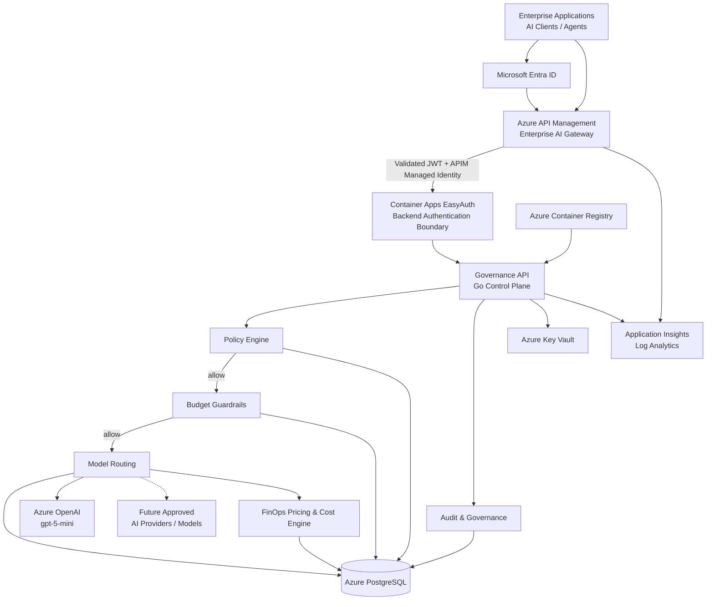
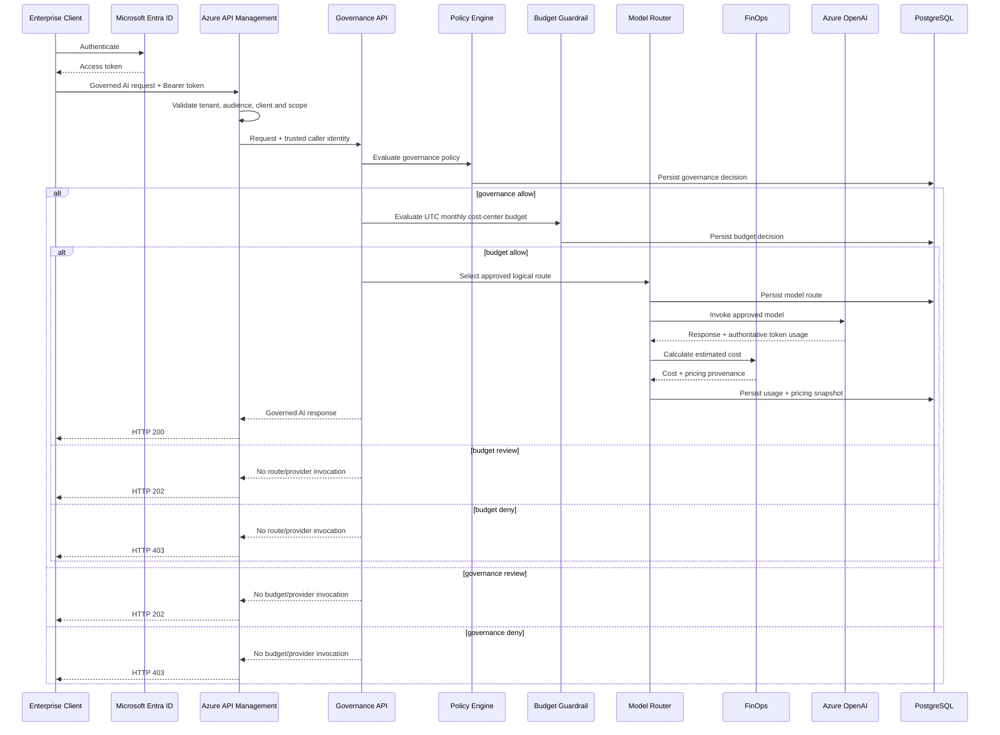
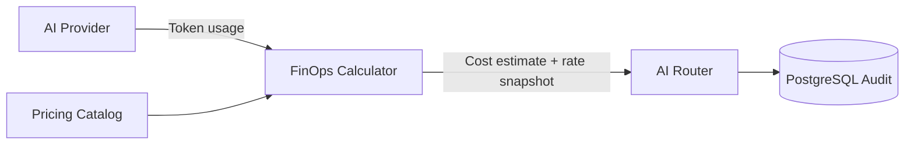

# Azure AI Governance Gateway

**Enterprise AI Governance & Control Plane reference architecture on Microsoft Azure**

Azure AI Governance Gateway is a reference implementation for governing enterprise access to Generative AI and ML services.

The project demonstrates how organizations can introduce a centralized governance layer between enterprise applications and AI providers to enforce policy, identity, auditability, model routing, data classification and usage/cost controls.

> **Status:** Active development
> **Current milestone:** Stage 6B complete — runtime cost-center budget guardrails deployed and verified end-to-end in Azure; Stage 6C next
> **Deployment:** Microsoft Azure, Sweden Central
> **Current AI runtime:** Azure OpenAI `gpt-5-mini` (`2025-08-07`, `GlobalStandard`)

---

## Why this project exists

Enterprise AI adoption introduces challenges that go far beyond exposing an LLM endpoint.

Organizations need to answer questions such as:

- Who is allowed to access AI services?
- Which users or applications may use which models?
- Which data classifications may be sent to each model/provider?
- How can sensitive or restricted data be blocked before provider invocation?
- How can every AI request and governance decision be audited?
- How can model selection be governed centrally?
- How can AI usage and cost be attributed to a user, application or cost center?
- How can providers or models be changed without modifying every client application?
- How can AI governance integrate with existing enterprise IAM, API management and observability platforms?
- How can budget and FinOps guardrails prevent uncontrolled AI consumption?

This project explores an architecture in which AI access becomes a **governed enterprise platform capability**, rather than a collection of direct model integrations.

---

## Architecture



### Architectural responsibility

**Microsoft Entra ID** is the enterprise identity provider.

**Azure API Management** is the enterprise-facing AI Gateway and the external authentication/policy enforcement boundary.

The custom **Governance API** is the control-plane/business-governance component responsible for:

- governance metadata;
- policy decisions;
- monthly cost-center budget guardrails;
- model/provider routing;
- audit records;
- usage attribution;
- FinOps cost estimation;
- pricing provenance.

The Go service is therefore **not intended to replace Azure API Management**.

### Responsibility separation

The current implementation deliberately separates provider execution from financial governance:

```text
provider -> reports authoritative usage
finops   -> owns pricing and cost calculation
budget   -> evaluates accrued spend before provider invocation
router   -> orchestrates governance, budget, routing and provider execution
database -> persists immutable audit evidence
```

This is a core design principle.

The provider does **not** know budgets or mutable pricing.

Unknown pricing is represented as:

```text
NULL
```

and is never silently converted to a fabricated zero cost.

---

## Current Azure deployment

| Capability | Technology | Status |
|---|---|:---:|
| Infrastructure as Code | Terraform | ✅ |
| Terraform remote state | Azure Blob Storage | ✅ |
| Monthly Azure cost guardrail | Azure Cost Management Budget (€150) | ✅ |
| Container runtime | Azure Container Apps Consumption | ✅ |
| Container registry | Azure Container Registry Basic | ✅ |
| Secrets | Azure Key Vault | ✅ |
| Governance API workload identity | User Assigned Managed Identity | ✅ |
| APIM workload identity | System Assigned Managed Identity | ✅ |
| Authorization | Azure RBAC | ✅ |
| Operational database | Azure Database for PostgreSQL Flexible Server 16 | ✅ |
| Logging | Azure Log Analytics | ✅ |
| Application telemetry foundation | Application Insights | ✅ |
| Governance API | Go | ✅ |
| Liveness endpoint | `/healthz` | ✅ |
| Database readiness endpoint | `/readyz` | ✅ |
| PostgreSQL connectivity | ACA → PostgreSQL | ✅ |
| Governance workflow | Go + PostgreSQL | ✅ |
| Enterprise gateway | Azure API Management Consumption | ✅ |
| Enterprise authentication | Microsoft Entra ID | ✅ |
| Backend authentication | Container Apps EasyAuth + APIM Managed Identity | ✅ |
| Trusted caller identity propagation | APIM validated JWT `oid` / `sub` | ✅ |
| AI provider abstraction | Provider-neutral Go interface | ✅ |
| Governed AI invocation | `POST /v1/ai/invoke` | ✅ |
| Azure OpenAI integration | Managed Identity + Responses API | ✅ |
| Azure OpenAI model | `gpt-5-mini` | ✅ |
| Token usage metering | Provider-authoritative usage | ✅ |
| Cached-token accounting | Azure OpenAI usage details | ✅ |
| FinOps pricing engine | Provider-neutral Go package | ✅ |
| Pricing provenance audit | PostgreSQL pricing snapshot | ✅ |
| Versioned DB migrations | Generic numbered migration runner | ✅ |
| Runtime budget enforcement | Governance budget guardrails | ✅ |
| Cost-aware routing | Budget/cost-aware model routing | Planned — Stage 6C |
| Governance dashboards | Reporting / visualization | Planned |
| CI/CD | Automated delivery pipeline | Planned |
| Production private networking | Private connectivity / controlled egress | Planned |

---

## Current request path

The current enterprise path is:



### Important security behavior

A client-supplied `caller_subject` is **not trusted** when traffic comes through APIM.

APIM validates the Entra token and derives the caller subject from:

```text
oid
```

with fallback to:

```text
sub
```

APIM overwrites the trusted internal caller header before forwarding the request.

This prevents a caller from claiming another enterprise identity through the JSON request body.

---

## Governance API

The custom control-plane component is implemented in **Go**.

Current endpoints include:

```text
GET  /healthz
GET  /readyz

POST /v1/governance/requests
GET  /v1/governance/requests/{requestID}

POST /v1/ai/invoke
```

### Liveness

`/healthz` verifies that the service process is alive.

Example:

```json
{
  "service": "governance-api",
  "status": "ok"
}
```

### Readiness

`/readyz` verifies that the service can access its required PostgreSQL dependency.

Example:

```json
{
  "database": "ok",
  "status": "ready"
}
```

Liveness and readiness are intentionally separated so that loss of the database does not incorrectly indicate that the application process itself has crashed.

---

## Governance policy

The first policy implementation is deliberately simple and deterministic.

Current baseline:

```text
public       -> allow
internal     -> allow
confidential -> review
restricted   -> deny
```

The governance decision occurs **before** model-provider invocation.

This is important for both security and FinOps.

For `review` and `deny`:

```text
provider_called = false
```

and no model tokens should be consumed.

Future stages will extend policy evaluation with:

- identity;
- application/client;
- use case;
- cost center;
- model/provider eligibility;
- data classification;
- budget state;
- provider/model cost;
- latency;
- model capability;
- enterprise policy configuration.

---

## Governance data model

The operational audit model now includes:

```text
governance_requests
policy_decisions
budget_policies
budget_decisions
model_routes
usage_records
```

A migration tracking table is also maintained:

```text
schema_migrations
```

### `governance_requests`

Represents an enterprise AI request and its governance context.

Captured attributes include:

- request ID;
- trusted caller identity;
- cost center;
- use case;
- data classification;
- requested model;
- prompt SHA-256 hash;
- prompt character count;
- request metadata;
- timestamp.

The raw prompt is intentionally **not persisted**.

### `policy_decisions`

Stores governance policy evaluations associated with a request.

Current decisions:

```text
allow
review
deny
```

### `budget_policies`

Stores the active monthly financial policy for each `cost_center`.

Current Stage 6B policy attributes include:

- unique cost center;
- USD monthly limit;
- review threshold percentage;
- enabled state;
- policy name;
- timestamps.

### `budget_decisions`

Stores one immutable budget decision for each governance-allowed request.

Each snapshot preserves:

- applicable policy;
- cost center;
- currency;
- UTC period start/end;
- accrued spend;
- monthly limit;
- review threshold;
- utilization;
- unknown-cost record count;
- decision and reason;
- evaluation timestamp.

### `model_routes`

Records routing decisions including:

- requested logical model;
- selected model;
- AI provider;
- routing reason;
- request relationship;
- timestamp.

### `usage_records`

Provides the foundation for AI FinOps and usage attribution.

Current fields include:

- provider;
- model;
- input tokens;
- cached input tokens;
- output tokens;
- estimated cost in USD;
- pricing source;
- pricing effective start date;
- input price per million tokens;
- cached input price per million tokens;
- output price per million tokens;
- request relationship;
- timestamp.

The selected pricing rates are persisted with each new usage record so that later pricing-catalog changes do not rewrite historical cost calculations.

Historical rows created before cached-token/pricing-audit support remain `NULL` for fields that were not known at the time.

No artificial backfill is performed.

---

## Database migrations

Database changes use versioned migrations:

```text
000001_initial_schema.up.sql
000002_usage_pricing_audit.up.sql
000003_budget_guardrails.up.sql
...
```

A generic migration runner:

```text
services/governance-api/scripts/run-migrations.sh
```

discovers numbered `*.up.sql` files, applies them in order, and records each version in:

```text
schema_migrations
```

The runner is designed to be idempotent:

```text
already applied -> verify name -> skip
not applied     -> BEGIN -> migration -> record version -> COMMIT
```

It also refuses to guess migration history when an existing core schema is found without a migration tracking table.

Azure migration access uses a temporary PostgreSQL firewall rule limited to the exact current public IPv4 address.

The rule is removed automatically after the migration session.

A persistent `0.0.0.0` "Allow Azure services" database rule is intentionally avoided.

---

## Data classification

The current data model supports:

```text
public
internal
confidential
restricted
```

The current baseline policy is intentionally simple, but the classification is designed to become one input to richer policy evaluation.

Example future policy:

```text
Restricted corporate data
        |
        v
Governance policy
        |
        +---- Approved controlled model -> ALLOW
        |
        +---- Unapproved external model -> DENY
```

---

## Identity and authentication

### Enterprise caller identity

Clients authenticate through **Microsoft Entra ID**.

The Governance API has its own Entra application/API registration and exposes:

```text
access_as_user
```

The demo client is authorized to request this scope.

APIM validates:

- tenant;
- API audience;
- client application;
- required scope.

### APIM to backend

APIM uses its **System Assigned Managed Identity** to authenticate to the Governance API backend.

Container Apps EasyAuth validates the backend token and accepts the APIM identity.

Direct anonymous access to protected backend routes is rejected.

A valid end-user token sent directly to the backend is also insufficient because the backend is restricted to the APIM identity.

### Governance API workload identity

The Governance API uses an Azure **User Assigned Managed Identity**.

Current RBAC roles include:

```text
AcrPull
Key Vault Secrets User
Cognitive Services OpenAI User
```

No Azure credentials or Azure OpenAI API keys are embedded in the application image.

### Secret management

PostgreSQL credentials are stored in **Azure Key Vault**.

The Container App consumes its database connection secret through Key Vault integration.

---

## Azure OpenAI integration

The currently deployed real provider is Azure OpenAI.

Current demo deployment:

```text
Azure OpenAI account: aoai-aigov-0d60fe3d
Region:               Sweden Central
Model:                gpt-5-mini
Model version:        2025-08-07
Deployment:           gpt-5-mini
SKU:                  GlobalStandard
Capacity:             10
Authentication:       Managed Identity
API style:            OpenAI Responses API
store:                false
```

The provider is deliberately stateless.

It returns:

- generated content;
- model;
- input token usage;
- cached input token usage;
- output token usage.

It does **not** calculate financial cost.

### Model selection history

The original Stage 5C deployment attempt targeted `gpt-4o-mini` (`2024-07-18`).

Azure reported that deployment version as deprecated, so the implementation was changed to:

```text
gpt-5-mini / 2025-08-07
```

This is an example of why provider/model lifecycle must be abstracted from enterprise clients.

---

## FinOps

Stage 6A introduced a provider-neutral FinOps layer.

### Pricing responsibility



### Current Azure OpenAI demo pricing

The current catalog uses Azure Retail Prices API rates discovered for the deployed regular `GlobalStandard` `gpt-5-mini` workload in Sweden Central.

```text
Input:        USD 0.25 / 1M tokens
Cached input: USD 0.025 / 1M tokens
Output:       USD 2.00 / 1M tokens
Effective:    2025-08-01T00:00:00Z
Source:       Azure Retail Prices API
```

The cached-input-aware formula is:

```text
non_cached_input_tokens = input_tokens - cached_input_tokens

estimated_cost =
    non_cached_input_tokens * input_rate
  + cached_input_tokens     * cached_input_rate
  + output_tokens           * output_rate
```

with all rates converted from per-million-token pricing.

Validation requires:

```text
0 <= cached_input_tokens <= input_tokens
```

### Pricing caveats

The calculated value is an **estimated governance/FinOps cost**, not an invoice.

Actual Azure billing may differ because of:

- future pricing changes;
- region;
- deployment SKU;
- contract/enterprise discounts;
- billing meters;
- provider-specific accounting;
- taxes and currency conversion.

Pricing must therefore remain external to provider code and auditable.

### Data residency note

The current demo uses Azure OpenAI `GlobalStandard`.

This deployment type may process model inference outside the selected Azure region.

The demo should therefore use synthetic/non-sensitive prompts.

Production regulated workloads must explicitly evaluate deployment type and data residency requirements.

---

## Budget guardrails

Stage 6B adds monthly application-level budget enforcement by `cost_center`.

Budget evaluation runs **only after governance returns `allow`** and **before model routing/provider invocation**.

The current budget period is the UTC calendar month.

Decision rules:

```text
missing cost center       -> review
missing active policy     -> review
unknown-cost usage exists -> review
monthly limit = 0         -> deny
spent >= limit            -> deny
threshold reached         -> review
otherwise                 -> allow
```

Missing or unknown financial state therefore fails closed rather than silently allowing provider execution.

Each governance-allowed request receives one persisted `budget_decisions` snapshot containing the applicable policy, period, accrued spend, limit, threshold, utilization, unknown-cost count, decision and reason.

For budget `review` and `deny`:

```text
provider_called = false
model_routes    = 0
usage_records   = 0
```

Azure APIM E2E validation confirmed:

```text
allow  -> HTTP 200 -> Azure OpenAI invoked
review -> HTTP 202 -> provider not invoked
deny   -> HTTP 403 -> provider not invoked
```

The final Azure PostgreSQL audit also confirmed that the synthetic raw prompt markers were not persisted.

### MVP budget concurrency limitation

The current implementation evaluates **accrued spend** and does not reserve the expected cost of the current request before provider invocation.

Therefore the monthly limit is a governance guardrail, **not an atomic hard cap**:

- the request currently executing can move total spend above the limit;
- concurrent allowed requests can observe the same pre-request balance and collectively overshoot it;
- the next request sees the updated accrued balance and can then be reviewed or denied.

Production hard-cap enforcement should introduce a reservation/ledger or another concurrency-safe financial pre-authorization mechanism.

---

## Immutable container deployment

The Governance API is built using a multi-stage Docker build.

Runtime properties include:

- Linux `amd64`;
- minimal Alpine runtime;
- CA certificates;
- non-root execution;
- no Go compiler in the runtime image.

Application artifacts are deployed using immutable OCI SHA-256 references rather than `latest`.

Example:

```text
acraigov...azurecr.io/governance-api@sha256:<digest>
```

This allows an Azure deployment to reference exactly the artifact that was built and tested.

---

## Infrastructure as Code

Azure infrastructure is managed with Terraform.

The project deliberately uses a review workflow for infrastructure changes:

```text
terraform fmt
      |
      v
terraform validate
      |
      v
terraform plan
      |
      v
review
      |
      v
terraform apply
      |
      v
verification
      |
      v
cost check
```

New paid Azure resources are not introduced directly through ad-hoc CLI operations when they belong in Terraform.

### Terraform state layout

The project uses multiple remote Terraform state files to reduce blast radius and improve operational clarity:

```text
bootstrap.tfstate
demo.tfstate
demo-network-access.tfstate
demo-identity.tfstate
```

Current responsibilities:

```text
bootstrap.tfstate
  -> Terraform backend infrastructure

demo.tfstate
  -> Main Azure demo infrastructure

demo-network-access.tfstate
  -> PostgreSQL firewall rules for Container Apps outbound IPs

demo-identity.tfstate
  -> Microsoft Entra application identity foundation
```

### Network-access state isolation

Azure Container Apps Consumption exposed a large outbound IP set.

At the time of isolation, **161 PostgreSQL firewall rules** were managed.

Keeping those rules in the main demo state caused unnecessarily slow routine planning.

Stage 3D moved them into a dedicated:

```text
demo-network-access.tfstate
```

so normal main-environment planning does not repeatedly process the full firewall-rule set.

---

## Demo vs production architecture

The current environment is deliberately optimized for a **low-cost demo**.

This means some implementation choices differ from the intended production topology.

### Current demo networking

Azure Container Apps Consumption currently reaches PostgreSQL through its public endpoint.

The ACA outbound IP set is explicitly allowlisted in PostgreSQL firewall rules maintained in a dedicated Terraform state.

This provides a workable low-cost demonstration environment, but it is **not the desired production networking pattern**.

### Production networking direction

A production deployment should use controlled/private networking, for example:

```text
Azure API Management
        |
        v
Private application network
        |
        v
Container Apps / AKS
        |
        v
VNet
        |
        +---- Private Endpoint / Private DNS
        |
        v
Azure PostgreSQL
```

Where stable public egress is required, a controlled NAT architecture can be introduced.

The explicit outbound-IP allowlist in this repository should therefore be understood as a **demo-specific cost optimization**, not as the recommended enterprise topology.

---

## Cost-conscious demo design

The demo infrastructure intentionally minimizes Azure consumption while preserving the architecture needed to demonstrate the platform.

Current choices include:

- Azure API Management Consumption;
- Azure Container Apps Consumption;
- scale-to-zero where possible;
- maximum one Governance API replica;
- `0.25` vCPU;
- `0.5 GiB` memory;
- PostgreSQL Burstable `B1ms`;
- PostgreSQL 32 GiB storage;
- 7-day database backup retention;
- no PostgreSQL HA;
- no geo-redundant PostgreSQL backup;
- Basic Azure Container Registry;
- Azure OpenAI pay-per-token `GlobalStandard`;
- monthly Azure budget guardrail of **€150**.

Production sizing is intentionally treated as a separate concern.

---

## Repository structure

```text
.
├── docs/
│   ├── DEVELOPMENT_HISTORY.md
│   └── ROADMAP.md
│
├── infra/
│   ├── bootstrap/
│   └── envs/
│       ├── demo/
│       │   ├── apim.tf
│       │   ├── apim_ai_api.tf
│       │   ├── apim_ai_policy.tf
│       │   ├── azure_openai.tf
│       │   ├── governance_api.tf
│       │   ├── postgresql.tf
│       │   └── ...
│       ├── demo-identity/
│       └── demo-network-access/
│
├── services/
│   └── governance-api/
│       ├── cmd/
│       │   └── governance-api/
│       ├── internal/
│       │   ├── airouter/
│       │   ├── config/
│       │   ├── database/
│       │   ├── finops/
│       │   ├── governance/
│       │   ├── httpserver/
│       │   └── provider/
│       ├── migrations/
│       ├── scripts/
│       ├── Dockerfile
│       ├── compose.dev.yml
│       ├── go.mod
│       └── go.sum
│
└── README.md
```

---

## Local development

### Requirements

Typical local development tools:

```text
Go
Docker / Docker Desktop
Terraform
Azure CLI
Git
GitHub CLI
jq
psql / PostgreSQL client
```

### Start local PostgreSQL and Governance API

The development Compose environment contains:

```text
postgres
governance-api
```

The API uses:

```text
PORT=8080
DATABASE_URL=...
```

Secrets are supplied through environment variables and are not committed to Git.

### Health checks

```bash
curl http://localhost:8080/healthz
curl http://localhost:8080/readyz
```

### Local AI provider

Local development can use the deterministic mock provider.

This allows governance, routing, persistence and FinOps logic to be tested without making paid model calls.

---

## Security principles

### No embedded credentials

Application images do not contain Azure, database or Azure OpenAI API credentials.

### Least privilege

Managed identities receive only permissions currently needed by each workload.

### Centralized secrets

Runtime secrets are stored in Azure Key Vault.

### Enterprise authentication boundary

Entra authentication is validated at APIM.

Backend access is separately protected through APIM Managed Identity and Container Apps EasyAuth.

### Trusted caller identity

Caller identity is derived from a validated token rather than trusted from user-controlled JSON.

### Governance before provider invocation

Policy `review` and `deny` stop before an AI provider is called.

This avoids both unauthorized model access and unnecessary token consumption.

### Immutable artifacts

Container deployments reference immutable image digests.

### Explicit governance audit

Governance, routing, usage and pricing evidence are persisted independently from the calling application.

### Raw prompt minimization

Raw prompts are not persisted by the Governance API.

The audit trail stores a cryptographic hash and character count instead.

### Infrastructure review

Infrastructure changes are reviewed through Terraform plans before deployment.

---

## Observability

The environment currently includes:

```text
Application Insights
Log Analytics
Container Apps logs
```

The observability model includes or is intended to include:

- API request telemetry;
- policy decision telemetry;
- model routing events;
- provider latency;
- AI request failures;
- token usage;
- cached token usage;
- estimated cost;
- pricing provenance;
- governance denials;
- security events;
- budget decisions / denials;
- future routing economics.

---

## Delivery progress

A detailed roadmap is maintained in:

[docs/ROADMAP.md](docs/ROADMAP.md)

Implementation and design-change history is maintained in:

[docs/DEVELOPMENT_HISTORY.md](docs/DEVELOPMENT_HISTORY.md)

### Stage 1 — Azure / Terraform foundation

- [x] Azure subscription integration
- [x] Terraform remote state
- [x] state storage account
- [x] resource groups
- [x] provider registration
- [x] monthly Azure budget

### Stage 2 — Platform foundation

- [x] Log Analytics
- [x] Application Insights
- [x] Azure Key Vault
- [x] Azure Container Registry
- [x] Azure Container Apps Environment
- [x] Consumption workload profile

### Stage 3 — Governance runtime and data foundation

- [x] PostgreSQL Flexible Server 16
- [x] Governance API runtime
- [x] `/healthz`
- [x] `/readyz`
- [x] governance schema
- [x] `POST /v1/governance/requests`
- [x] `GET /v1/governance/requests/{requestID}`
- [x] ALLOW / REVIEW / DENY workflow
- [x] audit persistence
- [x] Azure end-to-end verification
- [x] isolate Container Apps PostgreSQL firewall rules into dedicated Terraform state

### Stage 4 — Microsoft Entra ID and Azure API Management

- [x] Governance API Entra application
- [x] demo public client
- [x] `access_as_user` scope
- [x] Azure API Management Consumption
- [x] publish Governance API
- [x] validate Entra JWT at APIM
- [x] APIM Managed Identity backend authentication
- [x] Container Apps EasyAuth backend protection
- [x] direct anonymous backend request rejected
- [x] direct end-user token rejected by backend identity restriction
- [x] APIM authenticated request accepted

### Stage 5 — Governed AI provider gateway

- [x] provider-neutral AI abstraction
- [x] deterministic mock provider
- [x] logical model route `fast-general`
- [x] `POST /v1/ai/invoke`
- [x] governance before provider execution
- [x] route persistence
- [x] usage persistence
- [x] trusted Entra caller identity propagation from APIM
- [x] Azure OpenAI account and deployment
- [x] Managed Identity authentication to Azure OpenAI
- [x] `gpt-5-mini` real provider
- [x] real Azure OpenAI end-to-end inference
- [x] authoritative token usage capture
- [x] raw prompt not persisted

### Stage 6A — FinOps cost accounting foundation

- [x] provider-neutral pricing catalog
- [x] provider-neutral cost calculator
- [x] remove pricing responsibility from provider
- [x] Azure Retail Prices API rate discovery
- [x] cached-token-aware calculation
- [x] actual Azure OpenAI cached token capture
- [x] immutable pricing snapshot in API audit model
- [x] pricing audit persistence in PostgreSQL
- [x] migration `000002_usage_pricing_audit`
- [x] generic idempotent migration runner
- [x] Azure database migration
- [x] historical rows preserve unknown fields as `NULL`
- [x] FinOps-enabled Governance API image deployed
- [x] new Azure Container App revision healthy
- [x] Azure OpenAI FinOps E2E cost/persistence verification

### Stage 6B — Budget Guardrails

- [x] define versioned budget policy model
- [x] migration `000003_budget_guardrails`
- [x] monthly UTC cost-center budget periods
- [x] compute accrued spend before provider invocation
- [x] budget allow / review / deny behavior
- [x] fail closed for missing cost center or active policy
- [x] unknown-cost usage forces review
- [x] persist immutable budget decision evidence
- [x] budget review/deny stops before model routing and provider invocation
- [x] local HTTP and PostgreSQL verification
- [x] Azure database migration and budget-policy seed
- [x] Azure APIM E2E: allow `200`, review `202`, deny `403`
- [x] Azure PostgreSQL audit validation
- [x] raw prompt persistence check
- [x] timeout hardening for real AI response latency
- [x] document accrued-spend/concurrency limitation

### Stage 6C — Cost-aware Model Routing

- [ ] extend route catalog with model/provider economics
- [ ] route using governance + capability + cost + budget
- [ ] preserve explainable routing reason
- [ ] persist financial/routing evidence
- [ ] Azure end-to-end verification

---

## Current deployment checkpoint

As of **2026-09-05**:

```text
Resource group:
  rg-aigov-demo

Region:
  swedencentral

Governance API:
  ca-governance-api-demo

Active revision:
  ca-governance-api-demo--0000010

Traffic:
  100%

Health:
  Healthy

AI provider:
  azure-openai

AI deployment:
  gpt-5-mini

Current image:
  acraigov0d60fe3d.azurecr.io/governance-api
  @sha256:ccc3b32bfabd42e5f6daeb355152a8fc6e6f3ab63bfaf2a4dd6b363e587f3526

Database migrations:
  000001 initial_schema
  000002 usage_pricing_audit
  000003 budget_guardrails
```

Health verification:

```json
{
  "service": "governance-api",
  "status": "ok"
}
```

Readiness verification:

```json
{
  "database": "ok",
  "status": "ready"
}
```

Stage 6A FinOps and Stage 6B budget guardrails are verified end-to-end in Azure.

Final Stage 6B APIM behavior:

```text
BUDGET-ALLOW  -> HTTP 200
BUDGET-REVIEW -> HTTP 202
BUDGET-DENY   -> HTTP 403
```

For the final successful allow validation:

```text
provider:           azure-openai
model:              gpt-5-mini
input tokens:       15
cached input:       0
output tokens:      97
estimated cost USD: 0.00019775
```

The next implementation stage is **Stage 6C — Cost-aware Model Routing**.

---

## Technology stack

- Microsoft Azure
- Terraform
- Go
- PostgreSQL 16
- Docker
- Azure Container Apps
- Azure Container Registry
- Azure Key Vault
- Azure Managed Identity
- Azure RBAC
- Microsoft Entra ID
- Azure API Management
- Azure OpenAI
- OpenAI Go SDK
- Application Insights
- Log Analytics
- Azure CLI
- GitHub

Planned additions include:

- cost-aware multi-model routing;
- governance dashboards;
- CI/CD;
- production private networking;
- broader policy administration.

---

## Engineering approach

The project is intentionally developed incrementally:

```text
Infrastructure
      |
      v
Secure workload identity
      |
      v
Database
      |
      v
Application runtime
      |
      v
Governance data model
      |
      v
Governance workflow
      |
      v
Enterprise identity
      |
      v
API Management
      |
      v
Governed AI provider routing
      |
      v
Real Azure OpenAI
      |
      v
FinOps accounting
      |
      v
Budget guardrails
      |
      v
Cost-aware routing
      |
      v
Production hardening
```

Each stage is independently:

```text
planned
  ->
implemented
  ->
tested
  ->
reviewed
  ->
deployed
  ->
verified
  ->
cost checked
```

Important design changes are documented rather than silently replacing the original plan.

---

## Documentation

- [Roadmap](docs/ROADMAP.md)
- [Development history and architecture decisions](docs/DEVELOPMENT_HISTORY.md)

---

## Disclaimer

This repository is a reference architecture and demonstration project.

The current demo environment intentionally favors low operating cost and implementation transparency over full production-grade network isolation and high availability.

Production deployments should additionally consider:

- private networking;
- HA and disaster recovery;
- centralized policy administration;
- enterprise-grade identity governance;
- WAF / API protection;
- security monitoring;
- SIEM integration;
- data residency;
- regulatory requirements;
- provider-specific AI safety controls;
- CI/CD security gates;
- backup and recovery requirements;
- enterprise billing contracts;
- provider/model lifecycle management.

---

## Author

**Valerii Tsoi**

Enterprise Architecture · Engineering Leadership · AI Platforms · Cloud Architecture

GitHub: [ValeriiTsoi](https://github.com/ValeriiTsoi)
