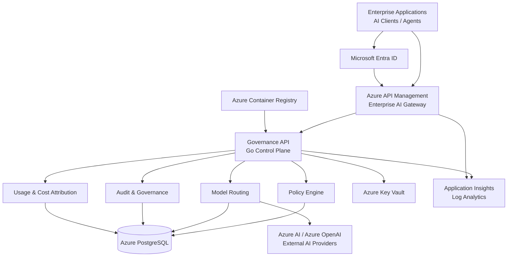

# Azure AI Governance Gateway

**Enterprise AI Governance & Control Plane reference architecture on Microsoft Azure**

Azure AI Governance Gateway is a reference implementation for governing enterprise access to Generative AI and ML services.

The project demonstrates how organizations can introduce a centralized governance layer between enterprise applications and AI providers to enforce policy, identity, auditability, model routing, data classification and usage/cost controls.

> **Status:** Active development  
> **Current milestone:** Stage 3B completed / Stage 3C starting  
> **Deployment:** Microsoft Azure, Sweden Central

---

## Why this project exists

Enterprise AI adoption introduces challenges that go far beyond exposing an LLM endpoint.

Organizations need to answer questions such as:

- Who is allowed to access AI services?
- Which users or applications may use which models?
- Which data classifications may be sent to each model/provider?
- How can sensitive or restricted data be blocked?
- How can every AI request and decision be audited?
- How can model selection be governed centrally?
- How can AI usage be attributed to a user, application or cost center?
- How can providers or models be changed without modifying every client application?
- How can AI governance integrate with existing enterprise IAM, API management and observability platforms?

This project explores an architecture in which AI access becomes a **governed enterprise platform capability**, rather than a collection of direct model integrations.

---

## Architecture



### Architectural responsibility

**Azure API Management** is the planned enterprise-facing AI Gateway and policy enforcement boundary.

The custom **Governance API** is a control-plane/business-governance component responsible for governance metadata, policy decisions, routing decisions, audit records and usage attribution.

The Go service is therefore **not intended to replace Azure API Management**.

---

## Current Azure deployment

| Capability | Technology | Status |
|---|---|:---:|
| Infrastructure as Code | Terraform | ✅ |
| Terraform remote state | Azure Blob Storage | ✅ |
| Cost guardrail | Azure Cost Management Budget | ✅ |
| Container runtime | Azure Container Apps | ✅ |
| Container registry | Azure Container Registry | ✅ |
| Secrets | Azure Key Vault | ✅ |
| Workload identity | User Assigned Managed Identity | ✅ |
| Authorization | Azure RBAC | ✅ |
| Operational database | Azure Database for PostgreSQL Flexible Server 16 | ✅ |
| Logging | Azure Log Analytics | ✅ |
| Application telemetry foundation | Application Insights | ✅ |
| Governance API | Go | ✅ |
| Container deployment | Azure Container Apps | ✅ |
| Liveness endpoint | `/healthz` | ✅ |
| Database readiness endpoint | `/readyz` | ✅ |
| PostgreSQL connectivity | ACA → PostgreSQL | ✅ |
| Governance workflow | Go + PostgreSQL | 🚧 |
| Enterprise gateway | Azure API Management | Planned |
| Enterprise authentication | Microsoft Entra ID | Planned |
| AI model/provider integration | Azure AI / external providers | Planned |

---

## Current request path

The currently implemented demo path is:

```text
Internet
   |
   v
Azure Container Apps
   |
   v
governance-api
   |
   +---- /healthz
   |
   +---- /readyz
   |
   v
Azure PostgreSQL
```

The target enterprise path evolves this into:

```text
Enterprise Client
       |
       v
Microsoft Entra ID
       |
       v
Azure API Management
       |
       v
Governance API
       |
       +---- Policy
       +---- Audit
       +---- Routing
       +---- Usage / Cost
       |
       v
AI Provider / Model
```

---

## Governance API

The first custom control-plane component is implemented in **Go**.

Current endpoints:

```text
GET /healthz
GET /readyz
```

### Liveness

`/healthz` verifies that the service process is alive.

Example:

```json
{
  "service": "governance-api",
  "status": "ok"
}
```

### Readiness

`/readyz` verifies that the service can access its required PostgreSQL dependency.

Example:

```json
{
  "database": "ok",
  "status": "ready"
}
```

Liveness and readiness are intentionally separated so that loss of the database does not incorrectly indicate that the application process itself has crashed.

---

## Governance data model

The first migration introduces four core governance entities:

```text
governance_requests
policy_decisions
model_routes
usage_records
```

### `governance_requests`

Represents an enterprise AI request and its governance context.

Examples of captured attributes:

- request ID;
- caller identity;
- cost center;
- use case;
- data classification;
- requested model;
- prompt hash;
- request metadata;
- timestamp.

### `policy_decisions`

Stores governance policy evaluations associated with a request.

Initial decisions:

```text
allow
deny
review
```

### `model_routes`

Records routing decisions such as:

- requested model;
- selected model;
- AI provider;
- routing reason.

### `usage_records`

Provides the foundation for AI FinOps and usage attribution:

- provider;
- model;
- input tokens;
- output tokens;
- estimated cost;
- request relationship.

---

## Data classification

The initial data model supports:

```text
public
internal
confidential
restricted
```

Future policy rules will use this classification together with identity, use case and model/provider attributes.

Example:

```text
Restricted corporate data
        |
        v
Governance policy
        |
        +---- Approved internal model -> ALLOW
        |
        +---- External public model  -> DENY
```

---

## Identity and secret management

The Governance API uses an Azure **User Assigned Managed Identity**.

Current RBAC permissions are intentionally limited to:

```text
AcrPull
Key Vault Secrets User
```

No Azure credentials are embedded in the application image.

PostgreSQL credentials are stored in **Azure Key Vault**, and the Container App consumes them through a Key Vault secret reference.

---

## Immutable container deployment

The Governance API is built using a multi-stage Docker build.

Runtime properties include:

- Linux `amd64`;
- minimal Alpine runtime;
- CA certificates;
- non-root execution;
- no Go compiler in the runtime image.

Application artifacts are deployed using immutable OCI SHA-256 references rather than `latest`.

Example:

```text
acraigov...azurecr.io/governance-api@sha256:<digest>
```

This allows an Azure deployment to reference exactly the artifact that was built and tested.

---

## Infrastructure as Code

Azure infrastructure is managed with Terraform.

The project deliberately uses a review workflow for infrastructure changes:

```text
terraform fmt
      |
      v
terraform validate
      |
      v
terraform plan
      |
      v
review
      |
      v
terraform apply
      |
      v
verification
      |
      v
cost check
```

Sensitive PostgreSQL values use Terraform ephemeral/write-only attributes where supported so that credentials are not intentionally persisted in Terraform plans or state.

---

## Demo vs production architecture

The current environment is deliberately optimized for a **low-cost demo**.

This means some implementation choices differ from the intended production topology.

### Current demo networking

Azure Container Apps Consumption currently reaches PostgreSQL through its public endpoint.

The current ACA outbound IP set is explicitly allowlisted in the PostgreSQL firewall.

This provides a workable low-cost demonstration environment, but it is **not the desired production networking pattern**.

Container Apps Consumption can expose a relatively large and potentially changing set of outbound addresses.

### Production networking direction

A production deployment should use controlled/private networking, for example:

```text
Azure API Management
        |
        v
Private application network
        |
        v
Container Apps / AKS
        |
        v
VNet
        |
        +---- Private Endpoint / Private DNS
        |
        v
Azure PostgreSQL
```

Where stable public egress is required, a controlled NAT architecture can be introduced.

The explicit outbound-IP allowlist in this repository should therefore be understood as a **demo-specific cost optimization**, not as the recommended enterprise topology.

---

## Cost-conscious demo design

The demo infrastructure intentionally minimizes Azure consumption while preserving the architecture needed to demonstrate the platform.

Current choices include:

- Azure Container Apps Consumption;
- scale-to-zero where possible;
- maximum one Governance API replica;
- `0.25` vCPU;
- `0.5 GiB` memory;
- PostgreSQL Burstable `B1ms`;
- PostgreSQL 32 GiB storage;
- 7-day database backup retention;
- no PostgreSQL HA;
- no geo-redundant PostgreSQL backup;
- Basic Azure Container Registry;
- monthly Azure budget guardrail.

Production sizing is intentionally treated as a separate concern.

---

## Repository structure

```text
.
├── infra/
│   ├── bootstrap/
│   └── envs/
│       └── demo/
│           ├── container_apps.tf
│           ├── governance_api.tf
│           ├── governance_api_egress_ips.tf
│           ├── postgresql.tf
│           ├── postgresql_firewall.tf
│           └── ...
│
├── services/
│   └── governance-api/
│       ├── cmd/
│       │   └── governance-api/
│       ├── internal/
│       │   ├── config/
│       │   ├── database/
│       │   └── httpserver/
│       ├── migrations/
│       ├── Dockerfile
│       ├── compose.dev.yml
│       ├── go.mod
│       └── go.sum
│
└── README.md
```

---

## Local development

### Requirements

Typical local development tools:

```text
Go
Docker / Docker Desktop
Terraform
Azure CLI
Git
GitHub CLI
jq
```

### Start local PostgreSQL and Governance API

The development Compose environment contains:

```text
postgres
governance-api
```

The API uses:

```text
PORT=8080
DATABASE_URL=...
```

Secrets are supplied through environment variables and are not committed to Git.

### Health checks

```bash
curl http://localhost:8080/healthz
curl http://localhost:8080/readyz
```

---

## Security principles

The implementation follows several basic security principles.

### No embedded credentials

Application images do not contain Azure or database credentials.

### Least privilege

Managed Identity receives only permissions currently needed by the workload.

### Centralized secrets

Runtime secrets are stored in Azure Key Vault.

### Immutable artifacts

Container deployments reference an immutable image digest.

### Explicit governance audit

Governance decisions are designed to be persisted independently from the calling application.

### Infrastructure review

Infrastructure changes are reviewed through Terraform plans before deployment.

---

## Observability

The environment currently includes:

```text
Application Insights
Log Analytics
```

The planned observability model includes:

- API request telemetry;
- policy decision telemetry;
- model routing events;
- provider latency;
- AI request failures;
- token usage;
- estimated cost;
- governance denials;
- security events.

---

## Delivery progress

### Stage 1 — Azure / Terraform foundation

- [x] Azure subscription integration
- [x] Terraform remote state
- [x] state storage account
- [x] resource groups
- [x] provider registration
- [x] monthly Azure budget

### Stage 2 — Platform foundation

- [x] Log Analytics
- [x] Application Insights
- [x] Azure Key Vault
- [x] Azure Container Registry
- [x] Azure Container Apps Environment
- [x] Consumption workload profile

### Stage 3A — PostgreSQL

- [x] PostgreSQL Flexible Server 16
- [x] Burstable B1ms
- [x] `aigov` database
- [x] Key Vault administrator credential
- [x] Terraform write-only secret handling

### Stage 3B — Governance API

- [x] Go service skeleton
- [x] structured JSON logging
- [x] graceful shutdown
- [x] HTTP timeouts
- [x] `/healthz`
- [x] PostgreSQL connection pool
- [x] `/readyz`
- [x] initial governance schema
- [x] local PostgreSQL development environment
- [x] Docker multi-stage build
- [x] non-root container runtime
- [x] Linux `amd64` build
- [x] Azure Container Registry publication
- [x] immutable image digest
- [x] User Assigned Managed Identity
- [x] `AcrPull`
- [x] Key Vault secret reference
- [x] Azure Container Apps deployment
- [x] PostgreSQL firewall connectivity
- [x] Azure `/healthz`
- [x] Azure `/readyz`

### Stage 3C — Governance workflow

- [ ] deploy migration to Azure PostgreSQL
- [ ] `POST /v1/governance/requests`
- [ ] request validation
- [ ] governance request persistence
- [ ] policy evaluation
- [ ] policy decision persistence
- [ ] audit trail
- [ ] `GET /v1/governance/requests/{id}`
- [ ] integration tests

### Planned enterprise capabilities

- [ ] Microsoft Entra ID authentication
- [ ] Azure API Management
- [ ] enterprise caller identity propagation
- [ ] configurable policy engine
- [ ] model/provider catalog
- [ ] AI provider abstraction
- [ ] model routing
- [ ] Azure AI integration
- [ ] usage metering
- [ ] cost-center attribution
- [ ] governance dashboards
- [ ] security and compliance reporting
- [ ] CI/CD
- [ ] production private networking

---

## Stage 3C target flow

The next functional milestone introduces the first end-to-end governance transaction:

```text
POST /v1/governance/requests
              |
              v
      Request validation
              |
              v
     Governance context
              |
              v
       Policy evaluation
              |
       +------+------+
       |             |
       v             v
     ALLOW          DENY
       |             |
       +------+------+
              |
              v
        Audit persistence
              |
              v
      PostgreSQL records
```

The request can then be inspected through:

```text
GET /v1/governance/requests/{request-id}
```

Later stages will insert actual AI model routing after the policy decision.

---

## Target enterprise capabilities

The longer-term architecture is intended to demonstrate:

### Identity

Microsoft Entra ID-based enterprise caller identity.

### Governance

Centralized controls for users, applications, use cases and data classifications.

### Policy enforcement

Allow, deny or review decisions before an AI request is sent to a provider.

### Provider abstraction

Enterprise applications should not need to bind directly to a specific model vendor.

### Model routing

Governance and operational rules can select an approved model/provider.

### Auditability

Every significant governance and routing decision can be persisted and queried.

### AI FinOps

Usage can be attributed to:

```text
user
application
business unit
use case
cost center
model
provider
```

### Observability

Technical telemetry and governance telemetry are treated as complementary concerns.

---

## Technology stack

- Microsoft Azure
- Terraform
- Go
- PostgreSQL 16
- Docker
- Azure Container Apps
- Azure Container Registry
- Azure Key Vault
- Azure Managed Identity
- Azure RBAC
- Application Insights
- Log Analytics
- Azure CLI
- GitHub

Planned additions include:

- Microsoft Entra ID
- Azure API Management
- Azure AI / Azure OpenAI
- CI/CD
- governance dashboards

---

## Engineering approach

The project is intentionally developed incrementally:

```text
Infrastructure
      |
      v
Secure workload identity
      |
      v
Database
      |
      v
Application runtime
      |
      v
Governance data model
      |
      v
Governance workflow
      |
      v
Enterprise identity
      |
      v
API Management
      |
      v
AI provider routing
      |
      v
Observability and FinOps
```

Each stage is independently planned, reviewed, deployed and verified.

---

## Disclaimer

This repository is a reference architecture and demonstration project.

The current demo environment intentionally favors low operating cost and implementation transparency over full production-grade network isolation and high availability.

Production deployments should additionally consider:

- private networking;
- HA and disaster recovery;
- centralized policy administration;
- enterprise-grade identity governance;
- WAF / API protection;
- security monitoring;
- SIEM integration;
- data residency;
- regulatory requirements;
- provider-specific AI safety controls;
- CI/CD security gates;
- backup and recovery requirements.

---

## Author

**Valerii Tsoi**

Enterprise Architecture · Engineering Leadership · AI Platforms · Cloud Architecture

GitHub: [ValeriiTsoi](https://github.com/ValeriiTsoi)
