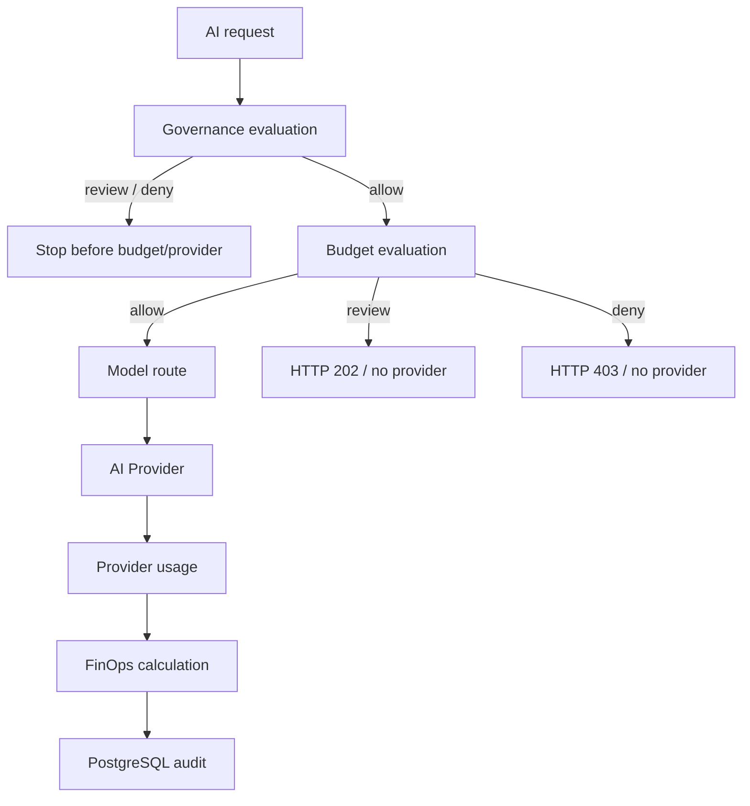

# Azure AI Governance Gateway — Development Roadmap

This document records the implementation roadmap for the Azure AI Governance Gateway and preserves the major adjustments made while the architecture evolved.

The roadmap is intentionally incremental.

Each stage should be independently:

```text
planned
  ->
implemented
  ->
tested
  ->
reviewed
  ->
deployed
  ->
verified
  ->
cost checked
```

The current priority is to build a credible enterprise governance path without introducing unnecessary Azure cost or premature production complexity.

---

## Roadmap status

| Stage | Scope | Status |
|---|---|:---:|
| 1 | Azure / Terraform foundation | ✅ Complete |
| 2 | Platform foundation | ✅ Complete |
| 3A | PostgreSQL foundation | ✅ Complete |
| 3B | Governance API runtime | ✅ Complete |
| 3C | Governance workflow | ✅ Complete |
| 3D | Terraform network-access state isolation | ✅ Complete |
| 4 | Microsoft Entra ID + Azure API Management | ✅ Complete |
| 5B | Provider-neutral governed AI invocation | ✅ Complete |
| 5B.5 | Trusted caller identity propagation | ✅ Complete |
| 5C | Azure OpenAI Managed Identity provider | ✅ Complete |
| 6A.1 | Provider-neutral FinOps pricing foundation | ✅ Complete |
| 6A.2 | Cost estimation moved into FinOps layer | ✅ Complete |
| 6A.3 | Cached-token-aware Azure OpenAI pricing | ✅ Complete |
| 6A.4 | Pricing audit persistence + migration runner | ✅ Complete |
| 6A.5 | Deploy FinOps-enabled Governance API | ✅ Complete |
| 6B | Budget Guardrails | ✅ Complete |
| 6C | Cost-aware Model Routing | ⬜ Planned |

---

# Stage 1 — Azure / Terraform foundation

## Objective

Establish a reproducible Azure foundation before application development.

## Delivered

- Azure subscription integration;
- Terraform provider configuration;
- Terraform remote state;
- state resource group;
- state storage account;
- state Blob container;
- demo resource group;
- Azure provider registration;
- monthly Azure budget guardrail.

## Cost policy

The demo budget is:

```text
€150 / month
```

New paid Azure resources follow:

```text
terraform plan
      ->
review
      ->
terraform apply
      ->
verify
      ->
cost check
```

---

# Stage 2 — Platform foundation

## Objective

Create the minimum managed Azure platform services required to host and observe the governance control plane.

## Delivered

- Log Analytics;
- Application Insights;
- Azure Key Vault;
- Azure Container Registry Basic;
- Azure Container Apps Environment;
- Consumption workload profile.

## Design principle

Prefer managed, consumption-oriented services where they preserve the architecture while minimizing demo operating cost.

---

# Stage 3A — PostgreSQL foundation

## Objective

Provide durable operational storage for governance decisions and audit evidence.

## Delivered

- Azure Database for PostgreSQL Flexible Server 16;
- Burstable `B1ms`;
- 32 GiB storage;
- `aigov` database;
- administrator credential in Key Vault;
- 7-day backup retention;
- public endpoint for low-cost demo connectivity;
- explicit firewall rules rather than broad database access.

## Production divergence

Production should use private networking and controlled egress rather than the current demo public-endpoint pattern.

---

# Stage 3B — Governance API runtime

## Objective

Create the first custom governance control-plane service.

## Delivered

- Go service;
- `net/http`;
- structured JSON logging;
- graceful shutdown;
- HTTP timeouts;
- PostgreSQL connection pool;
- `/healthz`;
- `/readyz`;
- Docker multi-stage build;
- non-root runtime;
- Linux `amd64` image;
- Azure Container Registry publication;
- immutable OCI digest deployment;
- User Assigned Managed Identity;
- Key Vault integration;
- Azure Container Apps deployment.

---

# Stage 3C — Governance workflow

## Objective

Implement the first complete governance transaction.

## Delivered

```text
POST /v1/governance/requests
```

and:

```text
GET /v1/governance/requests/{requestID}
```

Initial data model:

```text
governance_requests
policy_decisions
model_routes
usage_records
```

Initial policy decisions:

```text
allow
review
deny
```

Initial data classifications:

```text
public
internal
confidential
restricted
```

## Baseline behavior

```text
public       -> allow
internal     -> allow
confidential -> review
restricted   -> deny
```

## Audit behavior

Raw prompts are not persisted.

The governance record stores:

- prompt SHA-256;
- prompt character count;
- governance context;
- policy decision;
- timestamp.

---

# Stage 3D — Terraform network-access state isolation

## Why the plan changed

Azure Container Apps Consumption exposed a large outbound-IP set.

At the time of isolation, PostgreSQL required **161 individual firewall rules**.

Keeping those rules in the main `demo.tfstate` made routine Terraform planning unnecessarily slow.

## Adjustment

Move the firewall resources into:

```text
demo-network-access.tfstate
```

## Result

Main demo plans no longer repeatedly process the entire firewall-rule set.

Current state layout:

```text
bootstrap.tfstate
demo.tfstate
demo-network-access.tfstate
demo-identity.tfstate
```

## Production note

This is a demo optimization, not the target enterprise networking topology.

---

# Stage 4 — Microsoft Entra ID + Azure API Management

## Objective

Move from direct application access to an enterprise gateway and identity boundary.

## Delivered

### Entra identity foundation

Governance API application:

```text
identifier URI:
api://aigov-governance-api-demo
```

Delegated scope:

```text
access_as_user
```

A public demo client application was also created.

### Azure API Management

Deployment:

```text
APIM Consumption
```

Gateway responsibilities:

- validate Entra JWT;
- validate tenant;
- validate API audience;
- validate demo client;
- require `access_as_user`;
- expose governance API;
- expose governed AI invocation API.

### Backend authentication

APIM authenticates to the Governance API using APIM Managed Identity.

Container Apps EasyAuth protects the backend.

Expected security path:

```text
Client
  ->
Entra
  ->
APIM JWT validation
  ->
APIM Managed Identity
  ->
Container Apps EasyAuth
  ->
Governance API
```

## Verification

- anonymous direct backend request -> rejected;
- valid end-user JWT direct to backend -> rejected by backend identity restriction;
- authenticated APIM request -> accepted;
- health/readiness exclusions remain available.

---

# Stage 5B — Provider-neutral governed AI invocation

## Objective

Introduce AI execution without binding governance logic directly to a model vendor.

## Delivered

Provider interface concept:

```text
Provider
  Name()
  Invoke()
```

Initial deterministic provider:

```text
mock
```

Logical route:

```text
fast-general
```

New endpoint:

```text
POST /v1/ai/invoke
```

## Execution semantics

```text
governance
   |
   +-- allow  -> route -> provider -> usage persistence
   |
   +-- review -> stop
   |
   +-- deny   -> stop
```

This establishes the critical rule:

> Governance must complete before provider invocation.

---

# Stage 5B.5 — Trusted caller identity propagation

## Why the plan changed

The original API payload included a caller subject supplied by the client.

That value cannot be considered authoritative in an enterprise governance system.

## Adjustment

APIM now derives caller identity from the already validated JWT:

```text
oid
```

with fallback:

```text
sub
```

and overwrites the internal caller header.

## Result

The backend persists the identity derived from Entra rather than trusting a spoofable JSON field.

---

# Stage 5C — Azure OpenAI Managed Identity provider

## Objective

Replace the mock execution path with a real Azure OpenAI provider while preserving the provider-neutral architecture.

## Delivered

Azure OpenAI account:

```text
aoai-aigov-0d60fe3d
```

Deployment:

```text
model:      gpt-5-mini
version:    2025-08-07
SKU:        GlobalStandard
capacity:   10
```

Authentication:

```text
Governance API User Assigned Managed Identity
        +
Cognitive Services OpenAI User
```

No Azure OpenAI API key is required.

## Model lifecycle adjustment

The initial deployment attempt targeted:

```text
gpt-4o-mini / 2024-07-18
```

Azure reported that version as deprecated.

The deployment target was therefore changed to:

```text
gpt-5-mini / 2025-08-07
```

This validated the value of model/provider abstraction: client applications did not need to change.

## Provider behavior

The real provider returns:

- content;
- model;
- input tokens;
- output tokens;
- later extended cached-input usage.

The provider remains unaware of pricing and budgets.

## Verified

A real governed Azure OpenAI inference completed successfully.

The request was:

```text
governance -> allow -> route -> Azure OpenAI -> response -> usage audit
```

The raw prompt was not found in application logs or database audit records.

---

# Stage 6 — FinOps & Governance Guardrails

Stage 6 deliberately separates accounting, enforcement and routing.


---

# Stage 6A — Cost Accounting Foundation

## Architecture decision

Financial policy is part of governance.

Responsibility model:

```text
provider -> reports usage
finops   -> knows prices
router   -> orchestrates
database -> persists
```

Not:

```text
Azure OpenAI provider -> knows prices and budgets
```

---

## Stage 6A.1 — Provider-neutral FinOps pricing foundation

### Delivered

New package:

```text
internal/finops
```

Responsibilities:

- normalized provider/model pricing catalog;
- duplicate validation;
- negative-price rejection;
- token-based cost calculator;
- explicit unknown-price semantics.

Unknown price:

```text
Known = false
```

and downstream persistence:

```text
estimated_cost_usd = NULL
```

---

## Stage 6A.2 — Move cost estimation into FinOps

### Adjustment

Cost information was removed from the provider contract.

Provider usage contains only authoritative usage data.

The AI router now calls the FinOps calculator after provider execution.

### Result

The provider interface remains stable when prices change.

---

## Stage 6A.3 — Cached-token-aware Azure OpenAI pricing

### Why the plan changed

A simple:

```text
input_tokens * input_rate
```

formula is insufficient when Azure bills cached input tokens at a separate rate.

### Azure Retail Prices API discovery

For the current regular `GlobalStandard` `gpt-5-mini` workload:

```text
Input:        $0.25  / 1M tokens
Cached input: $0.025 / 1M tokens
Output:       $2.00  / 1M tokens
Effective:    2025-08-01T00:00:00Z
```

Priority Processing rates exist but are not used by the current deployment.

### Formula

```text
non_cached_input = input_tokens - cached_input_tokens

cost =
    non_cached_input * input_rate
  + cached_input      * cached_rate
  + output            * output_rate
```

Validation:

```text
0 <= cached_input_tokens <= input_tokens
```

### Provider extension

Azure OpenAI usage now maps:

```text
InputTokensDetails.CachedTokens
```

into the provider-neutral usage model.

---

## Stage 6A.4 — Pricing audit persistence

## Objective

Make each estimated cost explainable later.

## Delivered

`usage_records` now preserves:

```text
cached_input_tokens
pricing_source
pricing_effective_start_date
input_price_per_million_usd
cached_input_price_per_million_usd
output_price_per_million_usd
```

alongside:

```text
estimated_cost_usd
```

## Historical integrity decision

The migration intentionally does **not** default historical values.

Old rows therefore keep:

```text
NULL
```

for cached-token/pricing evidence that was not known when those requests ran.

This avoids rewriting history with assumptions.

## Migration

```text
000002_usage_pricing_audit
```

was tested:

```text
UP
DOWN
UP
```

locally before Azure deployment.

The migration was then applied to Azure PostgreSQL and recorded in:

```text
schema_migrations
```

## Generic migration runner

A reusable runner was introduced so future migrations do not require hardcoded shell logic.

Behavior:

```text
discover *.up.sql
      ->
sort by version
      ->
check schema_migrations
      ->
skip already applied
      OR
transactionally apply + register
```

Safety behavior:

```text
existing core schema
+
missing schema_migrations
=
STOP
```

The runner refuses to guess migration history.

---

## Stage 6A.5 — Deploy and verify FinOps-enabled Governance API

## Status

```text
COMPLETE
```

Stage 6A was deployed and verified end-to-end in Azure.

The FinOps implementation established:

```text
provider -> authoritative usage
finops   -> mutable pricing + cost estimate
database -> immutable pricing snapshot
```

Azure OpenAI pricing used by the demo:

```text
Input:        $0.25  / 1M tokens
Cached input: $0.025 / 1M tokens
Output:       $2.00  / 1M tokens
Effective:    2025-08-01T00:00:00Z
Source:       Azure Retail Prices API
```

The final 6A verification confirmed:

```text
authenticated Entra caller
governance allow
Azure OpenAI invocation
provider-authoritative input/cached/output tokens
estimated cost
pricing source
pricing effective date
selected rates
PostgreSQL persistence
raw prompt not persisted
```

Historical rows retain `NULL` for pricing fields that were not known when those requests executed.

A persistence defect in the pricing-rate snapshot was corrected in:

```text
514ff24 Fix FinOps pricing audit persistence
```

The correction was verified with a fresh Azure request and was not applied as a broad historical backfill.

---

# Stage 6B — Budget Guardrails

## Objective

Introduce financial policy enforcement before model invocation without adding new paid Azure infrastructure.

## Delivered

Database migration:

```text
000003_budget_guardrails
```

introduced:

```text
budget_policies
budget_decisions
```

The runtime budget scope is:

```text
cost_center + UTC calendar month
```

`budget_decisions` persists an immutable snapshot of the policy and financial state used for each governance-allowed request.

## Decision model

Budget evaluation executes only after governance `allow` and before model routing/provider invocation.

Current behavior:

```text
missing cost center       -> review
missing active policy     -> review
unknown-cost usage exists -> review
monthly limit = 0         -> deny
spent >= monthly limit    -> deny
utilization >= threshold  -> review
otherwise                 -> allow
```

Missing or unknown financial state therefore fails closed.

## Execution flow



## Non-negotiable invariant

Budget `review` and `deny` stop before model routing and provider invocation.

Verified:

```text
provider_called = false
model_routes    = 0
usage_records   = 0
```

## Verification

Unit and local integration verification covered:

```text
allow
review
deny
zero-limit deny
unknown-cost review
missing-policy review
missing-cost-center review
governance deny before budget
budget review/deny before routing/provider
```

Azure migration `000003` was applied and tracked successfully.

Synthetic Azure budget policies were created for:

```text
BUDGET-ALLOW
BUDGET-REVIEW
BUDGET-DENY
```

Final APIM E2E results:

```text
BUDGET-ALLOW  -> HTTP 200
BUDGET-REVIEW -> HTTP 202
BUDGET-DENY   -> HTTP 403
```

The final Azure PostgreSQL audit confirmed:

```text
ALLOW  -> 1 budget decision, 1 model route, 1 usage record
REVIEW -> 1 budget decision, 0 model routes, 0 usage records
DENY   -> 1 budget decision, 0 model routes, 0 usage records
```

The allow record retained:

```text
provider = azure-openai
model = gpt-5-mini
pricing_source = Azure Retail Prices API
pricing_effective_start_date = 2025-08-01
```

Raw prompt-content checks returned zero matches.

No new paid Azure resource was introduced by Stage 6B.

## Azure response-timeout hardening

During Azure E2E testing, one allowed request completed provider processing and audit persistence while the client received an empty HTTP `500`.

The leading diagnosis was the Go server's original:

```text
WriteTimeout = 15 seconds
```

because the backend logged successful completion with `provider_called=true`, no backend error was recorded, and a shorter synthetic request completed successfully.

The timeout was increased to:

```text
WriteTimeout = 120 seconds
```

in:

```text
e2cab50 Increase AI response write timeout
```

The post-fix Azure allow request returned `HTTP 200`.

Final immutable image:

```text
sha256:ccc3b32bfabd42e5f6daeb355152a8fc6e6f3ab63bfaf2a4dd6b363e587f3526
```

Final verified revision:

```text
ca-governance-api-demo--0000010
```

with 100% traffic and healthy status.

## MVP concurrency limitation

The current implementation uses **accrued spend** and does not reserve the expected cost of a request before provider invocation.

Consequences:

- the current request can move total spend above the monthly limit;
- concurrent requests may observe the same pre-request spend and collectively overshoot;
- the next evaluation sees the updated accrued balance and can review or deny.

The current implementation is therefore a governance guardrail, not an atomic financial hard cap.

Production hard-cap enforcement should use a reservation/ledger or another concurrency-safe pre-authorization mechanism.

---

# Stage 6C — Cost-aware Model Routing

## Objective

Use governance and economics together when selecting a model/provider.

## Target routing inputs

```text
governance policy
data classification
model capability
provider approval
latency
cost
budget state
availability
```

## Target behavior

The client continues to request a logical capability:

```text
fast-general
```

The platform decides the concrete route.

Example:

```text
fast-general
      |
      +-- gpt-5-mini / Azure OpenAI
      |
      +-- another approved lower-cost model
      |
      +-- controlled internal model
```

The routing decision must remain explainable.

Persist:

- requested logical model;
- routed provider;
- routed model;
- reason;
- applicable cost evidence;
- budget state.

---

# Beyond Stage 6 — Capability backlog

The following capabilities remain part of the target architecture but are intentionally deferred until the governance/FinOps path is stable.

## Configurable policy administration

- policy configuration rather than hardcoded baseline rules;
- policy versioning;
- policy lifecycle;
- approval workflow.

## Governance dashboards

- usage by model;
- usage by provider;
- spend by cost center;
- spend by use case;
- policy denials;
- review queue;
- routing distribution;
- cost trend;
- budget utilization.

## CI/CD

- automated Go tests;
- Terraform validation;
- policy/security checks;
- image build;
- immutable artifact publication;
- controlled Terraform deployment;
- migration execution;
- post-deployment verification.

## Production networking

- private endpoints;
- private DNS;
- VNet integration;
- controlled egress;
- NAT where appropriate;
- reduced public exposure.

## Resilience

- production PostgreSQL sizing;
- HA;
- backup/recovery validation;
- DR;
- multi-region architecture if required.

## Enterprise security

- WAF / edge protection;
- SIEM integration;
- security monitoring;
- privileged access governance;
- stronger workload segmentation.

## AI governance expansion

- provider safety settings;
- model lifecycle governance;
- prompt/data controls;
- content filtering policy;
- residency-aware routing;
- enterprise model catalog;
- RAG governance;
- agent governance.

---

# Roadmap principles

## 1. Governance before invocation

No provider should be called before the request passes applicable governance controls.

## 2. Provider neutrality

Enterprise clients should depend on logical platform capabilities rather than a specific model vendor.

## 3. Pricing outside providers

Provider implementations report usage.

FinOps owns mutable pricing.

## 4. Unknown is not zero

Missing pricing evidence is:

```text
NULL
```

not:

```text
0
```

## 5. Preserve historical truth

New audit fields should not be backfilled with assumptions.

## 6. Immutable deployment

Container releases are pinned by SHA-256 digest.

## 7. Terraform review before paid infrastructure changes

```text
plan -> review -> apply -> verify -> cost check
```

## 8. Demo architecture is not automatically production architecture

Low-cost public connectivity choices must be documented and replaced with controlled/private networking for production.

## 9. Design changes remain documented

When Azure capabilities, pricing, model lifecycle or implementation constraints change the plan, the roadmap records both the original direction and the chosen adjustment.

## 10. Accrued-spend guardrails are not reservations

A budget check based on already-recorded usage is not an atomic hard-cap mechanism.

If production requires strict financial pre-authorization, use a reservation/ledger or another concurrency-safe mechanism rather than assuming an accrued-spend check prevents all overshoot.
